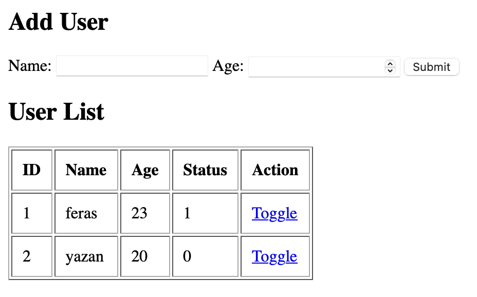

# User Status Dashboard

This is a simple web application built using **PHP** and **MySQL** to manage a list of users.  
It allows you to:
- Add new users (name and age)
- Display all users in a table
- Toggle the status between `0` and `1` for each user

## Technologies Used
- HTML
- PHP
- MySQL

## How to Run
1. Import the provided SQL file into your MySQL server.
2. Place the project folder inside your `htdocs` directory (e.g., `/htdocs/info/user.php`).
3. Start Apache and MySQL using XAMPP.
4. Visit `http://localhost/info/user.php`

## Screenshots

